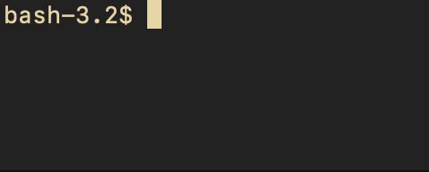

# colors.h
colors.h lets you use colors and other text styles in your terminal. Just add
the colors.h header to your C/C++ project. For documentation, just read
through the dead-simple header file for a list of self-explanatory names and
the occasional comment. For the `C_256()` macro, see
[this wikipedia page](https://en.wikipedia.org/wiki/ANSI_escape_code#8-bit)
for a table of colors, or use the `C_RGB()` macro.

### Example
Print " aloha " in dark red text (color 52 in 256-color mode), with a bright
yellow background, and make it both bold and blinking text.
 ```c
#include <stdio.h>
#include "colors.h"

int main() {
        printf(C_256(52) C_BG_BR_YELLOW SGR_BOLD SGR_BLINK" aloha \n"
                SGR_RESET);
        return 0;
}
 ```
 Output:
 
 

### License
colors.h is licensed under the
[ISC License](https://choosealicense.com/licenses/isc/). The license is also at
the top of the colors.h header file. If you copy colors.h into your project's
source code, do not remove the license from the header file.
